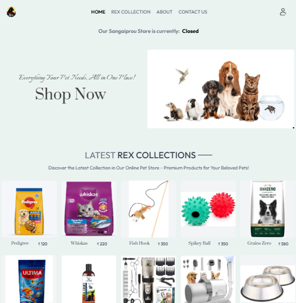
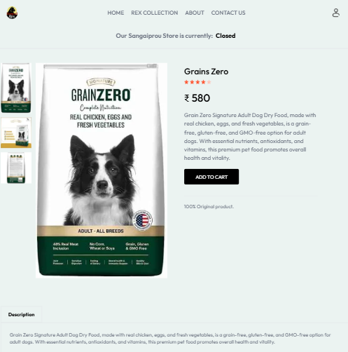
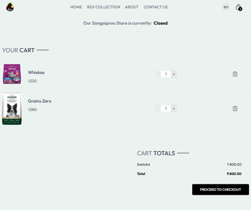
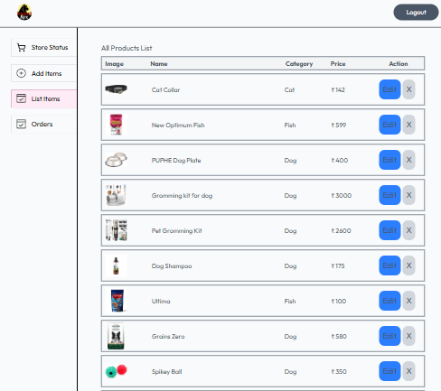

# 🐾 RoyaleRex - eCommerce Pet Store 🛒

  An  eCommerce platform for pet essentials, built with the **MERN Stack** (MongoDB, Express.js, React.js, Node.js).
RoyaleRex makes shopping for your furry friends easy, seamless, and delightful!
  This web app was built in mind with the purpose to serve for a smaller target audience (2 districts) and maybe will expand afterwards.
  Front end is deployed on vercel and backend is deployed on render(has one minute delay to start server if there is no activity)

---

## 🚀 Features

- 🐶 Browse & search pet products (food, toys, accessories, etc.)
- 🛒 Add to cart
- 🔒 User authentication (register/login/logout)
- 🧾 Order history and profile management
- 🧑‍💻 Admin dashboard: manage products, orders, and users

---

## 🛠️ Tech Stack

| Frontend      | Backend         | Database   | Auth         | Deployment       |
|---------------|-----------------|------------|--------------|------------------|
| React.js      | Node.js         | MongoDB    | JWT + bcrypt | Vercel  |
| Tailwind CSS  | Express.js      | Mongoose   |              | Render  |

---

## Frontend
- Used Redux for state management
- Used context for admin state management
- Used Axios for API connection

---

## Backend
- Used Cron Job for data cleaning
- Used JWT and bcrypt for authentication
- Used Cloudinary for image storage.

## 📸 Screenshots

> _Add your own screenshots or GIFs here_

- ✅ Home Page

  

- ✅ Product Detail

  

- ✅ Cart & Checkout

  

- ✅ Admin Dashboard

  

---

## 📂 Versions

- Frist version.
  (Current)
- Second version
  Will add customer reviews, payment system
